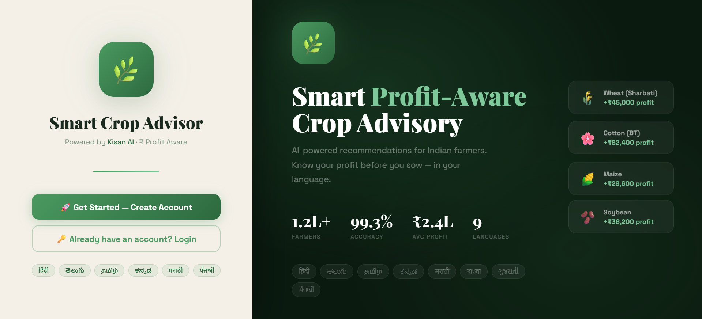
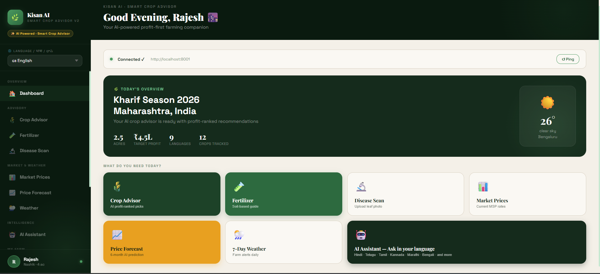
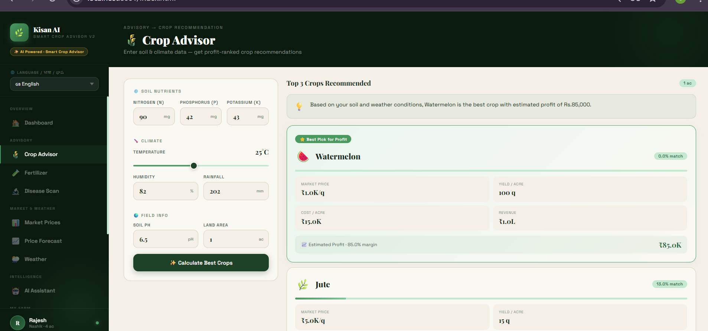
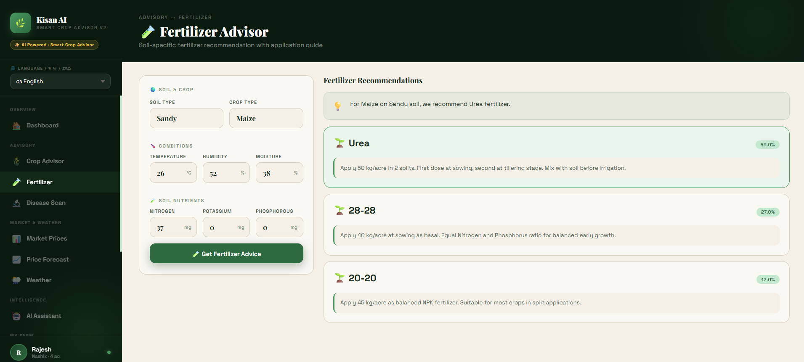
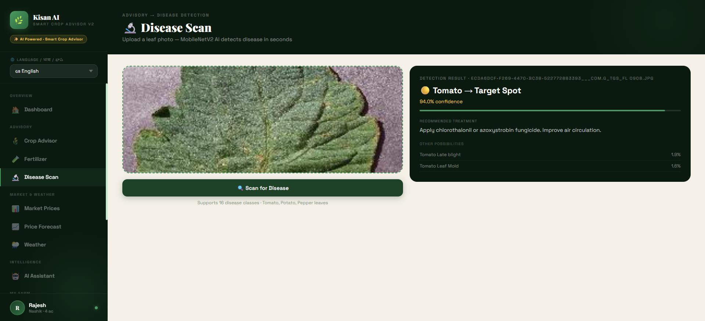
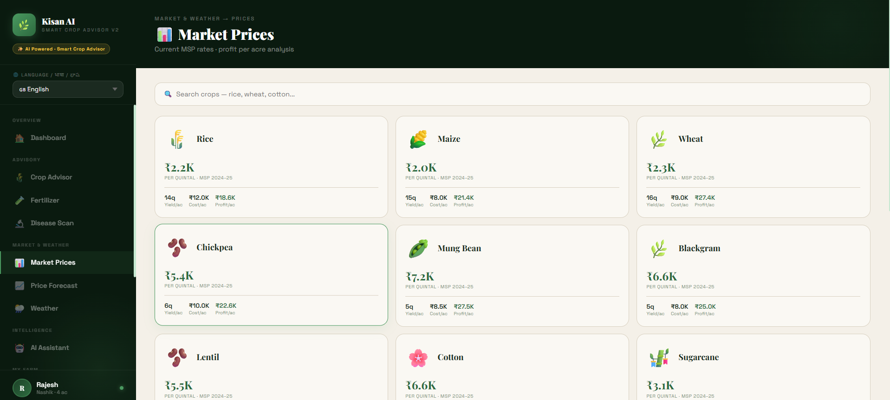
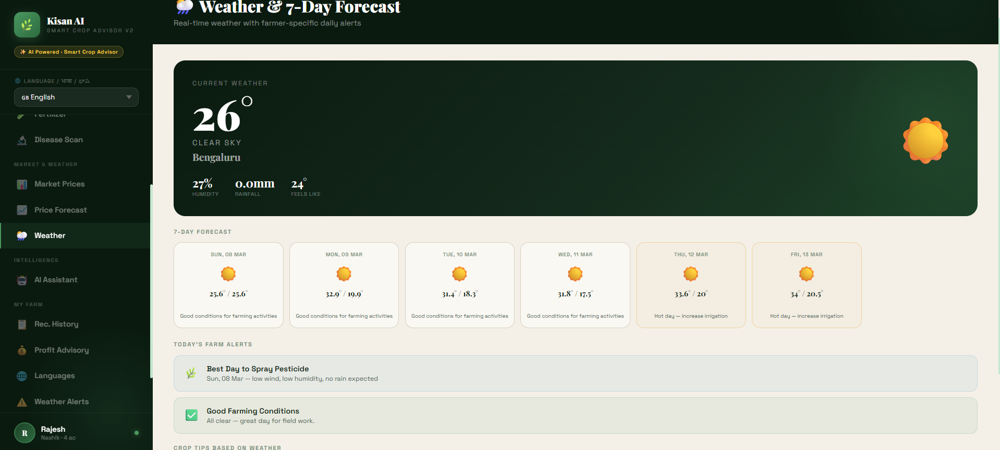
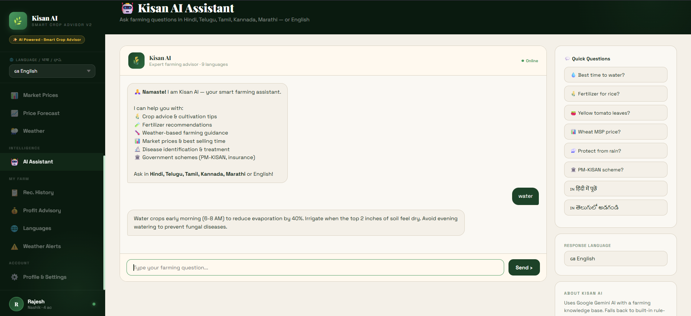

# 🌿 Kisan AI — Smart Crop Advisor v2

<p align="center">


</p>

**AI-powered, profit-first farming advisory system designed to help Indian farmers make data-driven agricultural decisions using machine learning, weather insights, and market forecasting.**

---

# 🚀 Project Highlights

✔ AI-powered crop recommendation system  
✔ Fertilizer recommendation using ML  
✔ Plant disease detection using deep learning  
✔ 6-month crop market price prediction  
✔ AI chatbot for farming guidance  
✔ Weather forecast with farming alerts  
✔ Multilingual support (9 Indian languages)  
✔ Progressive Web App (installable mobile app)

---

# ✨ What's New in v2

| Feature | v1 | v2 |
|---|---|---|
| Crop Recommendation | ✅ | ✅ |
| Fertilizer Advisor | ✅ | ✅ |
| Disease Detection | ✅ | ✅ |
| Market Prices (static) | ✅ | ✅ |
| **6-Month Price Forecast** | ❌ | ✅ Prophet AI |
| **AI Chatbot (Kisan AI)** | ❌ | ✅ Claude / rule-based |
| **Multilingual (9 langs)** | ❌ | ✅ Hindi, Telugu, Tamil… |
| **7-Day Weather Forecast** | ⚠️ Current only | ✅ Daily farm alerts |
| **PWA Mobile Install** | ❌ | ✅ Works offline |

---

# 🧠 AI Models

| Model | Algorithm | Accuracy | Dataset |
|---|---|---|---|
| Crop Recommendation | Random Forest | **99.3%** | 2200 rows, 22 crops |
| Fertilizer Recommendation | Random Forest | **100%** | 99 rows, 7 fertilizers |
| Disease Detection | MobileNetV2 | **~95%** | PlantVillage (16 classes) |
| Market Forecast | Prophet (Meta) | Time Series | 4 years monthly data |

---

# 🚀 Quick Start

### 1️⃣ Install dependencies

```bash
pip install -r requirements.txt
```

### 2️⃣ Train models (first time only)

```bash
# Train crop & fertilizer models
python notebooks/train_models.py

# Train market price prediction
python notebooks/train_market_predictor.py
```

### 3️⃣ Start API server

```bash
cd api
uvicorn main:app --reload --port 8001
```

Open in browser:

```
http://localhost:8001
```

### 4️⃣ Open the App

Open

```
frontend/index.html
```

or access through the backend.

---

# 📁 Project Structure

```
smart-crop-advisor-v2
│
├── api
│   ├── main.py
│   ├── chatbot.py
│   ├── translator.py
│   ├── market_predictor.py
│   └── weather_forecast.py
│
├── models
│   ├── crop_model.pkl
│   ├── fertilizer_model.pkl
│   ├── disease_model.h5
│   ├── market_prophet_models.pkl
│   └── market_forecasts_cache.json
│
├── data
│   └── market_prices_historical.csv
│
├── notebooks
│   ├── train_models.py
│   └── train_market_predictor.py
│
├── frontend
│   ├── index.html
│   └── manifest.json
│
├── requirements.txt
├── render.yaml
└── README.md
```

---

# 🌐 API Endpoints

```
GET  /health                 → server status
GET  /languages              → supported languages list
POST /predict/crop           → crop recommendation + profit
POST /predict/fertilizer     → fertilizer recommendation
POST /predict/disease        → leaf disease detection
GET  /market/price           → current MSP price
GET  /market/forecast        → 6-month AI price forecast
GET  /weather                → current weather
GET  /weather/forecast       → 7-day forecast + alerts
POST /chat                   → AI chatbot (Kisan AI)
POST /translate              → translate any text
```

---

# 🌍 Supported Languages

English · हिंदी · తెలుగు · தமிழ் · ಕನ್ನಡ · मराठी · বাংলা · ગુજરાતી · ਪੰਜਾਬੀ

---

# ☁️ Deployment

## GitHub Pages (Frontend)

Push to GitHub → **Settings → Pages → Source → `/frontend`**

---

## Render (Backend)

Build command

```
pip install -r ../requirements.txt
```

Start command

```
uvicorn main:app --host 0.0.0.0 --port $PORT
```

Environment variables

```
ANTHROPIC_API_KEY
OPENWEATHER_API_KEY
```

---

## Hugging Face Spaces (Recommended)

1. Create new Space  
2. Choose **Docker / Gradio**  
3. Push repository  
4. Add API keys as secrets  

---

# 📱 PWA Installation

### Android
Chrome → Menu → **Add to Home Screen**

### iPhone
Safari → Share → **Add to Home Screen**

App opens **like a native mobile app**.

---

# 🔑 API Keys Required

| Service | Purpose | Free Tier |
|---|---|---|
| OpenWeatherMap | Weather data | 60 calls/min |
| Anthropic Claude | AI chatbot | Pay per use |

Without Anthropic key, chatbot switches to **built-in rule-based responses**.

---

# 📸 Application Screenshots

### Landing Page


### Dashboard


### Account Creation


### Crop Advisor


### Fertilizer Recommendation


### Disease Detection


### Market Prices


### Price Forecast


### Weather Forecast


### AI Assistant


### Recommendation History


### Profit Advisory


### Language Translation


### Weather Alerts


### Profile & Settings


---

# 👨‍💻 Author

**Mohan Namburu**

B.Tech Computer Science  
Sastra Deemed University,Thanjavur.

GitHub  
https://github.com/mohannamburu18

---

# ⭐ Support

If you like this project:

⭐ Star the repository  
🍴 Fork the repo  
📢 Share with others  
